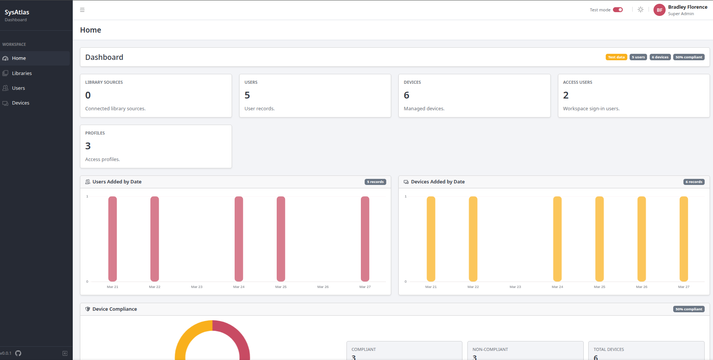
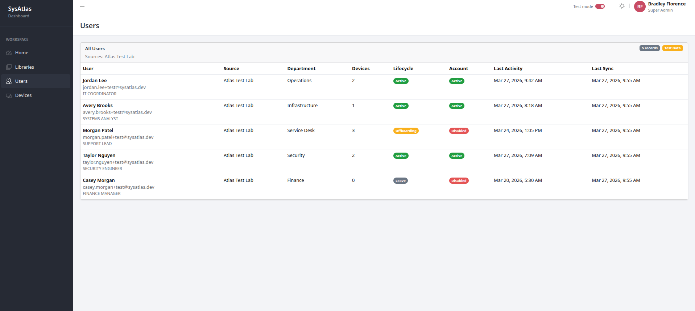
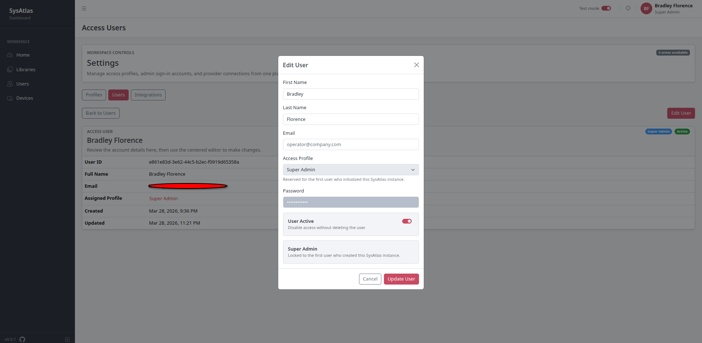

# SysAtlas

## [Systems Atlas (A.T.L.A.S) - Systems Automation Tool Linking All Systems](https://sys-atlas.vercel.app/)

*(Click link for live demo)*

> Is a systems first integration tool for dedicated Systems Administrators looking to automate their workflow all in one place.

### Built to handle out of the box integrations for typical Systems Administrator tools such as:

- Active Directory
- Intune
- Microsoft 365 Admin Center
- Microsoft Entra
- Microsoft Exchange Admin Center
- Microsoft Sharepoint
- Microsoft Teams
- Verizon Wireless
- Zoho One
- Zoom
- More to come - Please feel free to request new integrations, as well as add your own PRs for additional.

